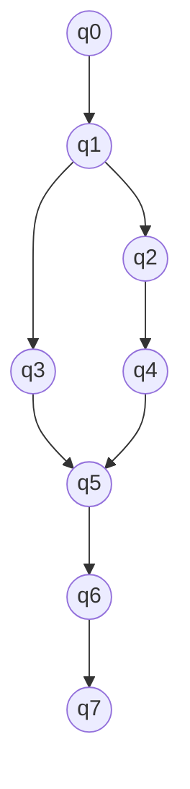

# Automata Computer Science

Greek word automaton, which means “a moving mechanical device made in imitation of a human being”.

In computer science, **an automaton** (plural: automata) is a mathematical model used to describe how a system or process behaves over time. It is a theoretical construct that consists of a set of states, a set of inputs, a set of outputs, and a set of rules that define the transitions between states based on the inputs.

Automata are commonly used in the theory of computation to study the behavior of algorithms and formal languages. 

There are many types of automata, including: 
- finite-state machines
- pushdown automata
- Turing machines

each with its own set of rules and computational power.

Finite-state machines, for example, are a type of automaton that are used to recognize regular languages, while pushdown automata are used to recognize context-free languages. Turing machines, on the other hand, are a more general type of automaton that can recognize any recursively enumerable language.

Automata are used in a wide range of applications, including natural language processing, compiler design, artificial intelligence, and robotics, among others.

